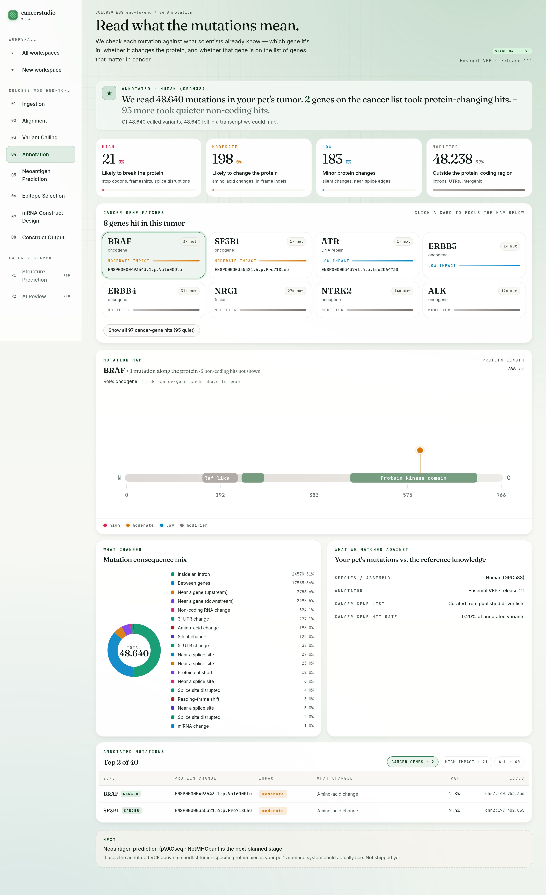
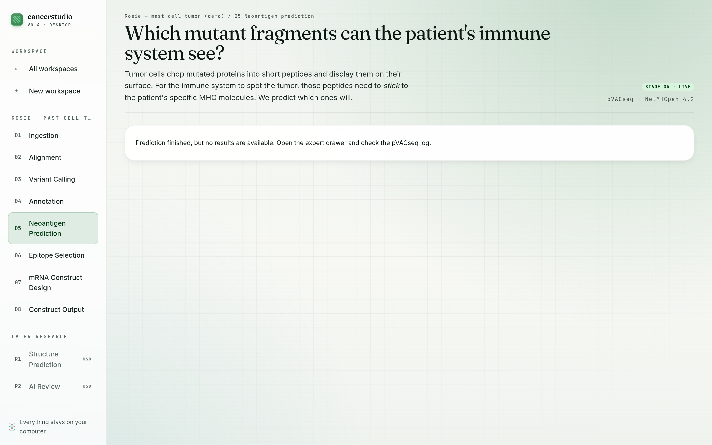
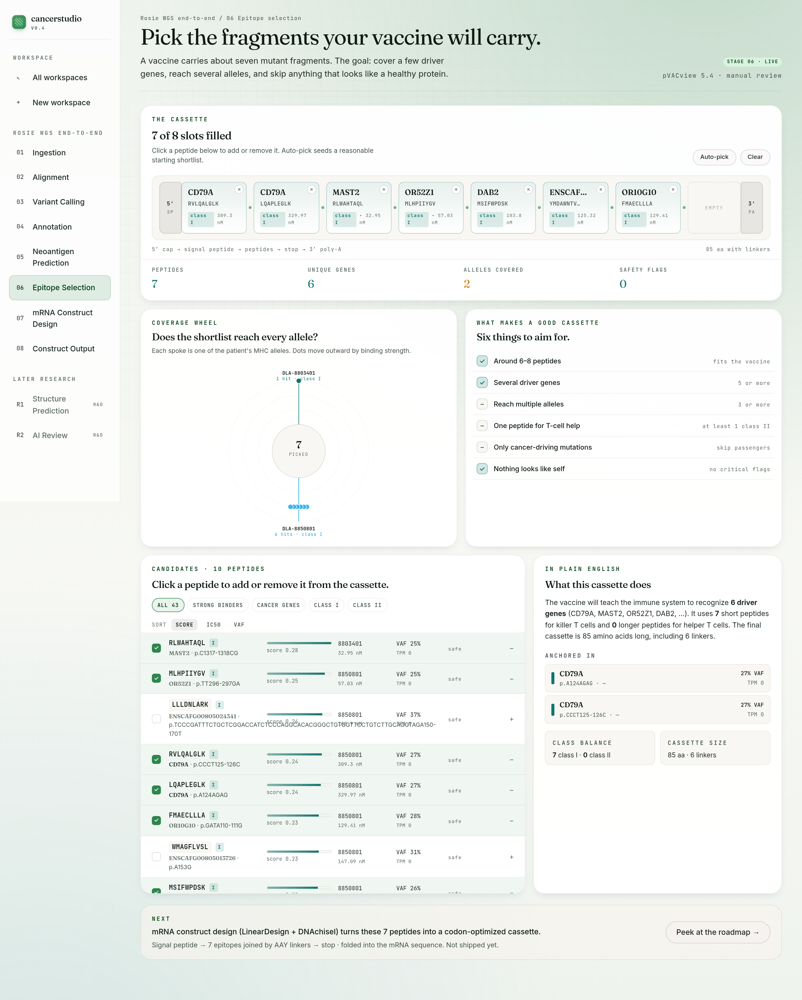
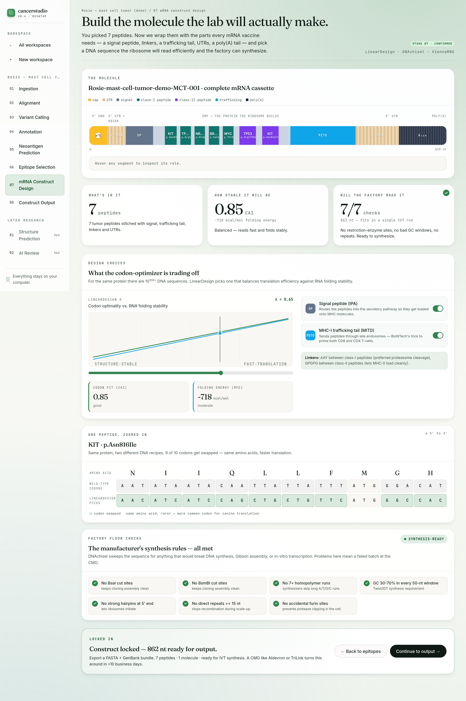
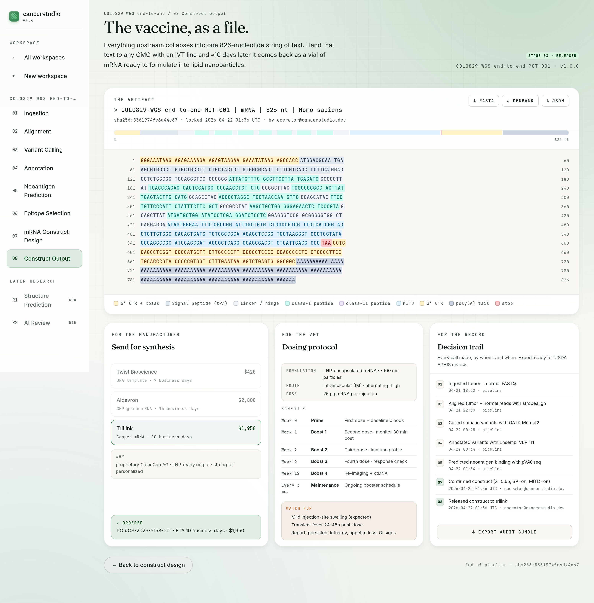

# cancerstudio

> **DISCLAIMER:** This software is provided for research and educational purposes only. Not intended for clinical or veterinary use. No warranty of fitness for any particular purpose.

> Cure your cancer. *Today.*

Sample your DNA. Compute your cure. cancerstudio designs a personalized mRNA vaccine from the mutations in *your* tumor — for dogs, cats, and humans.

**Site:** <https://niach.github.io/cancerstudio/> &nbsp;•&nbsp; **Status:** open source · self-hosted · v0.4

| Pick a species | Stage the samples | Run alignment | Find the mutations | Read what they mean |
| --- | --- | --- | --- | --- |
|  |  |  |  |  |

| Score the neoantigens | Curate the cassette | Design the construct | Hand off the vaccine | |
| --- | --- | --- | --- | --- |
|  |  |  |  | |

## Sample. Compute. Cure.

**Sample.** Sequence the tumor and a matched healthy sample at any standard lab. Two FASTQ files.

**Compute.** Run cancerstudio on *your* machine. Eight guided stages compare tumor vs. healthy, find the cancer-specific *mutations*, and design the molecule. ≈12 hours on a workstation.

**Cure.** Send the resulting FASTA to a GMP manufacturer. A vial arrives roughly ten days later.

## Eight stages. Twelve hours. One molecule.

| # | Stage | State | Tools |
| --- | --- | --- | --- |
| 1 | Ingestion | **Live** | samtools, pigz, fastp |
| 2 | Alignment | **Live** — chunked stop-and-resume on commodity hardware | strobealign, samtools |
| 3 | Variant Calling | **Live** — karyogram + plain-English filter buckets, Broad 1000G panel-of-normals on human runs | GATK Mutect2 (GPU via NVIDIA Parabricks when available) |
| 4 | Annotation | **Live** — cancer-gene cards + lollipop plot | Ensembl VEP 111 |
| 5 | Neoantigen Prediction | **Live** — binding buckets + peptide × allele heatmap + antigen funnel | pVACseq 5.4.0, NetMHCpan 4.2, NetMHCIIpan 4.3 |
| 6 | Epitope Selection | **Live** — 8-slot cassette curation UI | pVACview + custom scoring |
| 7 | mRNA Construct Design | **Live** — molecule hero + λ slider trading CAI vs. MFE + codon swap preview + 7/7 manufacturability checks | LinearDesign, DNAchisel, ViennaRNA |
| 8 | Construct Output | **Live** — color-coded FASTA with FASTA/GenBank/JSON downloads, CMO release flow, vet dosing, audit trail | pVACvector, Biopython |

Every live stage is pause-and-resumable. Progress is surfaced honestly, tool names live in the expert drawer.

## What you'll need

### Inputs

Tumor + matched-normal sequencing for one patient. **FASTQ, BAM, or CRAM.** ≥30× coverage for confident somatic variant calling. Drop the files in `~/cancerstudio-data/inbox/` and the app registers them into a workspace.

### Hardware

| | Recommended |
| --- | --- |
| RAM | 64 GB — strobealign indexing peaks around 31 GB free |
| CPU | 16 cores |
| Disk | 1 TB SSD — a 30× human WGS costs ~400 GB in the workspace (deduped BAMs + FASTQs); multiple cases share the ~55 GB reference + VEP cache + PON footprint |
| GPU | NVIDIA Ampere+ (RTX 3090 / 4090 / A-series / H-series) — Parabricks accelerates stage 3 Mutect2 ~10× |
| OS | Linux |

The backend — FastAPI, samtools, pigz, strobealign, GATK, Parabricks, VEP, pVACtools — ships in one Docker image layered on `nvcr.io/nvidia/clara/clara-parabricks:4.7.0-1`. The Next.js frontend runs on the host. No cloud, no object storage.

### Licenses

Two externally-licensed binaries must be installed before stage 5 runs. Both are free for academic use, but **you bring your own keys** — we can't redistribute them.

- **NetMHCpan 4.2** — DTU Health Tech, <https://services.healthtech.dtu.dk/services/NetMHCpan-4.2/>
- **NetMHCIIpan 4.3** — DTU Health Tech, <https://services.healthtech.dtu.dk/services/NetMHCIIpan-4.3/>

Fill the academic-license form, agree to the DTU terms, and download the Linux tarball. Turnaround is usually same-day. Commercial license (if you ever ship the product for pay) is a separate channel at `health-software@dtu.dk`. Without the binaries, stage 5 preflight refuses to start and tells you exactly which file is missing.

### Reference

Species reference genome — GRCh38 (human), UU_Cfam_GSD_1.0 (dog), or Felis_catus_9.0 (cat). Auto-downloaded on first alignment. If your workstation has less than 35 GB of free RAM, run `bash scripts/prepare-reference.sh` once beforehand to index outside the live app.

### Panel-of-normals (human only)

Human workspaces apply the Broad's 1000 Genomes panel-of-normals to Mutect2 so recurrent artefacts and low-frequency germline variants get filtered at call time. The Broad ships the VCF in UCSC convention (`chr1…chrM`); cancerstudio uses Ensembl GRCh38 (`1…MT`), so it auto-downloads the VCF on first variant-calling run, renames + re-orders contigs to match the reference FAI, and builds the Parabricks prepon sidecar for GPU runs. Lives under `~/cancerstudio-data/references/pon/grch38/`. Set `CANCERSTUDIO_PON_GRCH38_VCF=""` in `.env` to disable, or point at a custom VCF path to override.

Dog and cat workspaces skip the PON (no curated canine / feline panel exists yet); the Variant Calling screen shows a muted "No panel-of-normals available for &lt;species&gt;" caption instead.

## Install

### 1. Docker

On Ubuntu / Debian / Linux Mint:

```bash
curl -fsSL https://get.docker.com | sudo bash
sudo usermod -aG docker "$USER"
```

On macOS or Windows, install [Docker Desktop](https://www.docker.com/products/docker-desktop). For GPU variant calling on Linux, also install the [NVIDIA Container Toolkit](https://docs.nvidia.com/datacenter/cloud-native/container-toolkit/latest/install-guide.html).

### 2. Clone and build

```bash
git clone https://github.com/Niach/cancerstudio.git
cd cancerstudio
npm install
docker compose build                    # ~10 GB image, first build is slow
```

### 3. Drop the DTU binaries in place

Extract the tarballs so the directory layout looks like this:

```
~/cancerstudio-data/netmhc/
├── netMHCpan-4.2/
└── netMHCIIpan-4.3/
```

That path is bind-mounted into the container at `/tools/src:ro`, which matches the stock wrapper scripts' hardcoded `NMHOME` — no script edits required. Override with `CANCERSTUDIO_NETMHC_DIR=/some/other/path` in `.env` if you want them elsewhere.

### 4. Run

```bash
npm run dev:all                         # backend on :8000 + frontend on :3000
```

Open <http://localhost:3000>. Create a workspace, pick a species, drop in your FASTQs, follow the stages.

## Troubleshooting

**Alignment refuses to start with "insufficient memory."** Indexing the human reference peaks around 31 GB of RAM. Either free some up or run `bash scripts/prepare-reference.sh` once, which builds the index outside the live app.

**Stage 5 preflight says a NetMHC binary is missing.** The DTU tarballs aren't in the mount. Check `ls ~/cancerstudio-data/netmhc/` — you should see `netMHCpan-4.2/` and `netMHCIIpan-4.3/` as directories, not tarballs.

**Stage 5 finishes with zero peptides.** Your patient alleles weren't recognized by pvacseq. The Patient MHC panel now marks these with a strikethrough + `SKIPPED` pill and the reason. For dog, pvacseq only recognizes a handful of DLA-88 alleles and zero class II alleles.

**Annotation complains about missing TSL fields.** Rerun stage 4 on the workspace — older annotations predate the `--tsl` flag and need refreshing.

## For developers

Frontend: Next.js 15, React 19, TypeScript, Tailwind. Backend: FastAPI + SQLAlchemy, all bioinformatics tools in one Docker image, SQLite under `~/cancerstudio-data`.

Dev workflow:

```bash
npm run backend            # docker compose up — FastAPI on :8000
npm run dev                # Next.js on :3000
npm run dev:all            # both, concurrently
```

Fast tests (lint + TS + backend non-integration):

```bash
npm run test:fast
```

Browser and live real-data paths:

```bash
npx playwright install chromium
npm run test:integration
npm run sample-data:smoke
npm run test:backend:real-data
npm run test:browser:real-data
```

Sample datasets for smoke and full validation runs:

```bash
npm run sample-data:smoke                 # COLO829 smoke (~50k read pairs per lane)
npm run sample-data:full                  # COLO829 full 100x WGS (~174 GB)
npm run sample-data:alignment             # BAM/CRAM normalization fixture
python3 scripts/fetch_canine_dlbcl_sample_data.py         # canine DLBCL smoke
python3 scripts/fetch_canine_dlbcl_sample_data.py --mode full  # full DLBCL1 pair (~45 GB)
```

Regenerate the screenshots in this README (frontend + backend must be running):

```bash
# Stages 1–5 need a real completed pipeline run; point the script at that workspace.
node scripts/take-screenshots.mjs <workspace-id>

# Stages 6–8 can be captured from a synthetic demo workspace that skips the heavy
# bioinformatics (inserts minimum DB stubs only — not suitable for any real run).
docker cp scripts/seed_demo_workspace.py cancerstudio-backend:/tmp/seed.py
WORKSPACE_ID=$(docker exec cancerstudio-backend python /tmp/seed.py)
node scripts/take-screenshots.mjs --stages=6,7,8 "$WORKSPACE_ID"
```

Local overrides live in `.env` — see `.env.example` for the full list. The common ones:

- `CANCERSTUDIO_DATA_ROOT` — where workspace artifacts and references live (default `~/cancerstudio-data`)
- `CANCERSTUDIO_NETMHC_DIR` — where the DTU binaries live (default `${CANCERSTUDIO_DATA_ROOT}/netmhc`)
- `REFERENCE_*_FASTA` — hand-built reference FASTAs per species
- `CANCERSTUDIO_PON_GRCH38_VCF` — panel-of-normals override (default `${CANCERSTUDIO_DATA_ROOT}/references/pon/grch38/1000g_pon.ensembl.vcf.gz`; set empty to disable)
- `CANCERSTUDIO_PVACSEQ_THREADS` — pvacseq parallelism (default `min(cpu_count, 8)`)
- `CANCERSTUDIO_CLASS_I_PREDICTOR` — class-I binding predictor. Default `NetMHCpan` (DTU-licensed, requires the binary in `/tools/src/netMHCpan-4.2/`). Set to `MHCflurry` or `MHCflurryEL` to use the license-free openvax predictor instead — validated to match NetMHCpan AUC = 1.000 on the canonical TAA benchmark. Ignored for non-human species (MHCflurry has no DLA/FLA allele data). Class-II still requires NetMHCIIpan regardless.

Alignment compute knobs (chunk size, per-chunk aligner threads, samtools sort memory, parallel chunks) are tunable from the UI's Compute Settings drawer on the alignment stage — no env file edit needed. They persist to `${CANCERSTUDIO_DATA_ROOT}/settings.json`.

## Credits

cancerstudio is inspired by [Paul Conyngham's 2025 personalized mRNA vaccine for his dog Rosie](https://www.unsw.edu.au/newsroom/news/2025/) (mast cell cancer, 75% tumor shrinkage). His pipeline — BWA-MEM2 → Mutect2 → VEP → pVACseq with NetMHCpan — proved the approach works on a single-patient, single-desktop scale. cancerstudio is an attempt to make that pipeline accessible as a guided workspace, species-flexible by default.

Built on the shoulders of:

- [pVACtools](https://github.com/griffithlab/pVACtools) (Griffith Lab)
- [NetMHCpan / NetMHCIIpan](https://services.healthtech.dtu.dk/) (DTU Health Tech)
- [Ensembl VEP](https://www.ensembl.org/info/docs/tools/vep/) + its pVACseq-ready plugins (Frameshift, Wildtype, Downstream)
- [GATK Mutect2](https://gatk.broadinstitute.org/) and [NVIDIA Parabricks](https://www.nvidia.com/en-us/clara/genomics/)
- [strobealign](https://github.com/ksahlin/strobealign), [samtools](https://www.htslib.org/), [pigz](https://zlib.net/pigz/)
