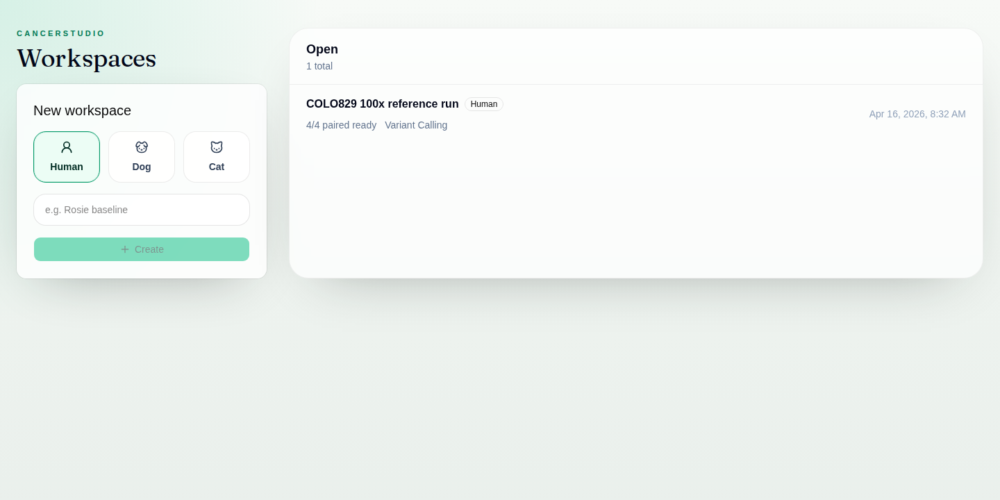
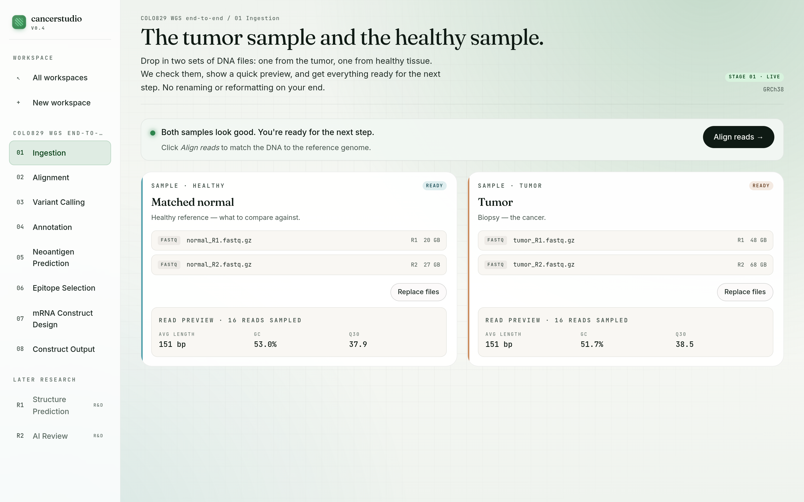
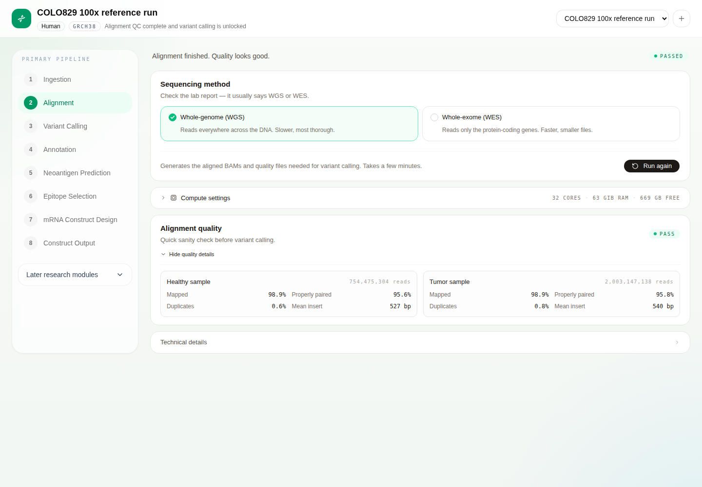

# cancerstudio

Two DNA samples in, one mRNA vaccine out. cancerstudio is a desktop-first studio for designing personalized cancer vaccines for humans, dogs, and cats. You point the app at local tumor and matched-normal sequencing files, it prepares alignment-ready inputs on your disk, aligns them against a species reference, and stages the rest of the neoantigen workflow.

Project site: <https://niach.github.io/cancerstudio/>

## Screenshots

| Pick a species | Stage the samples | Run alignment | Call variants |
| --- | --- | --- | --- |
|  |  |  |  |

## Pipeline

`Ingestion → Alignment → Variant Calling → Annotation → Neoantigen Prediction → Epitope Selection → mRNA Construct Design → Construct Output`

| # | Stage | State | Tools |
| --- | --- | --- | --- |
| 1 | Ingestion | **Live** | samtools, pigz, fastp |
| 2 | Alignment | **Live** | strobealign, samtools |
| 3 | Variant Calling | **Scaffolded** — UI + API wired, Mutect2 orchestration in progress | GATK Mutect2 |
| 4 | Annotation | Planned | Ensembl VEP |
| 5 | Neoantigen Prediction | Planned | pVACseq, NetMHCpan |
| 6 | Epitope Selection | Planned | pVACview |
| 7 | mRNA Construct Design | Planned | LinearDesign, DNAchisel |
| 8 | Construct Output | Planned | pVACvector, Biopython |

Structure Prediction and AI Review live in a separate research track.

### Stage 2: chunked alignment on commodity hardware

The alignment pipeline splits each paired FASTQ into ~20M-read chunks and aligns them in parallel with fresh strobealign workers, then merges the per-chunk coord-sorted BAMs. A watcher thread enqueues chunks as they land on disk, so aligners start within ~60 s of the split beginning instead of waiting for the full split pass. A bounded queue back-pressures the splitter. Compute knobs (chunk size, parallelism, aligner threads, sort memory) are exposed in the UI with a live RAM-footprint estimator.

The panel surfaces honest progress for multi-hour runs: blended progress bar (5 % ref prep + 75 % chunk alignment + 15 % finalize + 5 % stats) + per-phase sub-bars, rolling-window ETA, heartbeat + stall detection, live command tail, and a desktop notification on long-run completion.

**Stop and resume.** Every aligned chunk is persisted atomically to `workspaces/{id}/alignment/{run_id}/chunks/{lane}/chunk_NNNN.coord-sorted.bam` with a manifest at `manifest.json`. Two side-by-side buttons surface the choice at decision time: *Stop & keep progress* preserves the manifest and every completed chunk BAM so a subsequent *Resume* skips them and only realigns the rest; *Cancel & discard* wipes the run directory and starts fresh. Finalize steps (markdup, index, flagstat, idxstats, stats) are idempotent — a pause during the tail phase only rebuilds what's missing on resume.

Verified end-to-end on COLO829 100× WGS (~2B tumor + 754M normal read pairs) on a 32-core workstation with 62 GB RAM: alignment finished in ~6h 26m, QC verdict pass, 98.91% tumor mapped / 98.86% normal mapped, 10 artifacts persisted.

## How it works

- Desktop-first runtime: Electron shell + local Next.js renderer + local FastAPI pipeline engine. No cloud, no Docker, no object storage.
- Reference-in-place intake: your source FASTQ/BAM/CRAM files stay where they live. Only derived artifacts (canonical FASTQ, BAM/BAI, QC, reference bundles, SQLite) land in the app-data directory.
- Species presets: human `GRCh38`, dog `CanFam4`, cat `felCat9`. Missing references are downloaded and indexed on first alignment.
- Paired-lane model: tumor and normal are separate lanes. Alignment unlocks only when both lanes are paired-end ready; variant calling unlocks only after alignment passes QC.

## Stack

- Frontend: Next.js 15.5, React 19, TypeScript, Tailwind CSS
- Desktop shell: Electron
- Backend: FastAPI, SQLAlchemy, samtools, pigz, strobealign, GATK Mutect2 (scaffolded)
- Storage: local filesystem + SQLite

## Local development

Install dependencies once:

```bash
npm install
python -m venv .venv
source .venv/bin/activate
pip install -r backend/requirements.txt
```

Run the desktop app in development:

```bash
npm run desktop:dev
```

This starts:

- Next.js on `127.0.0.1:3000`
- FastAPI on `127.0.0.1:8000`
- Electron once both services are healthy

If you want the processes split out manually:

```bash
npm run desktop:frontend
npm run desktop:backend
npm run desktop:electron
```

JetBrains users can run the shared `Cancerstudio Electron App` config from `.run/`.

## Environment

Copy `.env.example` to `.env` for local overrides. The most important settings are:

- `CANCERSTUDIO_APP_DATA_DIR`: managed app-data root for local outputs and cached references
- `LOCAL_SQLITE_PATH`: optional explicit SQLite location
- `SAMTOOLS_REFERENCE_FASTA`: local FASTA used when CRAM normalization needs a reference
- `REFERENCE_*_FASTA`: optional manual override for human/dog/cat references

If you do not set `REFERENCE_*_FASTA`, cancerstudio caches preset references under the app-data directory and prepares them on first alignment.

## System requirements

cancerstudio shells out to bioinformatics binaries from the FastAPI backend. They must be on `PATH` (or pointed at via the env overrides below) before the live pipeline stages can run.

| Tool | Purpose | Used by |
|------|---------|---------|
| `samtools` ≥ 1.16 | BAM/CRAM normalization, sort, index, flagstat, idxstats, stats, markdup, merge | Ingestion + Alignment |
| `strobealign` ≥ 0.17 | Reference indexing and paired-end alignment | Alignment |
| `pigz` ≥ 2.6 | Multithreaded FASTQ compression, parallel chunk splitting | Ingestion + Alignment |
| `gatk` ≥ 4.5 (+ JDK 17) | Mutect2 somatic caller, CreateSequenceDictionary | Variant Calling (scaffolded) |

If any required tool is missing the backend rejects the relevant API call up-front with a structured `503 missing_tools` response, and the UI surfaces a friendly callout listing what to install — no more raw `[Errno 2]` stack traces.

### Install on Ubuntu / Debian / Linux Mint

A helper script handles all four. It pulls `samtools` + `pigz` + `openjdk-17-jre-headless` + the build toolchain from apt, builds `strobealign` v0.17.0 from source, and drops GATK 4.5.0.0 into `/usr/local/gatk`:

```bash
sudo bash scripts/install-bioinformatics-deps.sh
```

### Install on macOS

```bash
brew install samtools pigz strobealign openjdk@17
brew install --cask gatk     # or download from broadinstitute/gatk releases
```

> **Memory warning for the first alignment run.** `strobealign --create-index` peaks at roughly **31 GB of RAM** while building `genome.fa.r150.sti`. The backend refuses to start indexing if `/proc/meminfo` reports less than 35 GB available, so your box won't get pushed into swap. If you're on a modest machine, close your browser, IDE, and dev servers before hitting *Start alignment* the first time — or run `scripts/prepare-reference.sh` from a clean terminal to finish the index in isolation. Once the index is on disk the backend detects it on subsequent runs and skips bootstrapping entirely. The same script also runs `gatk CreateSequenceDictionary` so variant calling can use the reference on first run.

### Verify

```bash
samtools --version | head -1
strobealign --version
pigz --version
gatk --version
```

### Env overrides

Useful when you have non-standard binary locations or want to point at a specific build:

- `SAMTOOLS_BINARY` — absolute path or alternate command name (default `samtools`)
- `ALIGNMENT_STROBEALIGN_BINARY` — absolute path or alternate command name (default `strobealign`)
- `PIGZ_BINARY` — absolute path or alternate command name (default `pigz`)
- `PIGZ_THREADS` — worker count for pigz compression

Alignment compute is also tunable at runtime from the UI (Compute settings section on the alignment stage) — no env file edit needed. The overrides persist to `{CANCERSTUDIO_APP_DATA_DIR}/settings.json`:

- Chunk size (read pairs per chunk, default 20M)
- Parallel chunks (default 2)
- Aligner threads per chunk
- samtools sort memory per thread

### Standalone reference indexer

If *Start alignment* refuses with an "insufficient memory" callout, or you'd just rather not run the memory-hungry indexing inside the live app:

```bash
bash scripts/prepare-reference.sh
```

Defaults to `~/.local/share/cancerstudio/references/grch38/genome.fa`. Pass a different FASTA as the first argument to index something else. The script checks `MemAvailable`, refuses to start if <35 GB is free, runs `samtools faidx` + `strobealign --create-index -r 150`, then `gatk CreateSequenceDictionary` so Mutect2 can use the reference. Once it finishes, restart the backend — the alignment stage will detect the existing index and skip bootstrapping entirely.

## Tests

```bash
npm run lint
npm run test:backend:fast
```

Real-data smoke fixtures:

```bash
npm run sample-data:smoke
```

Browser ingestion smoke:

```bash
npx playwright install chromium
npm run test:browser:real-data
```

Backend real-data smoke:

```bash
npm run test:backend:real-data
```

Opt-in live alignment smoke:

- uses the matched SEQC2 tumor/normal FASTQ smoke pair (or the full COLO829 WGS pair if you point `REAL_DATA_SAMPLE_DIR` at it and set `REAL_DATA_ASSAY_TYPE=wgs`)
- requires local `samtools`, `strobealign`, `pigz`
- downloads and indexes `GRCh38` on first run unless `REFERENCE_GRCH38_FASTA` is already set
- runs only when `REAL_DATA_RUN_ALIGNMENT=1`

## Sample data

The repo includes helpers for public smoke fixtures:

- SEQC2 human tumor/normal FASTQ smoke data for ingestion and opt-in live alignment smoke
- COLO829/COLO829BL matched melanoma pair (ENA PRJEB27698) — full 100× tumor + 38× normal WGS for validating the chunked alignment pipeline at production scale
- a tiny BAM/CRAM smoke dataset for local normalization checks only

The COLO829 full fetch is ~174 GB compressed. Per-file md5s are checked against ENA-published values on download so silent corruption fails loudly.

Download with:

```bash
npm run sample-data:smoke         # SEQC2 WES smoke (~50k read pairs per lane)
npm run sample-data:wgs-smoke     # COLO829 smoke (~50k read pairs per lane)
npm run sample-data:wgs-full      # COLO829 full 100x WGS (~174 GB)
npm run sample-data:alignment     # BAM/CRAM normalization fixture
```
