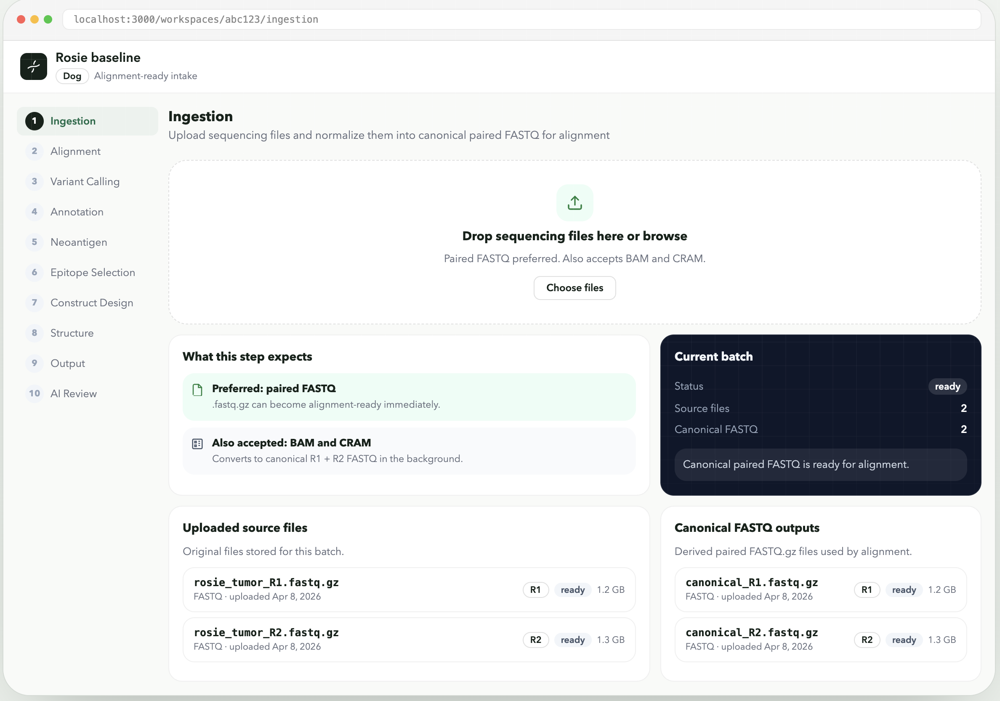
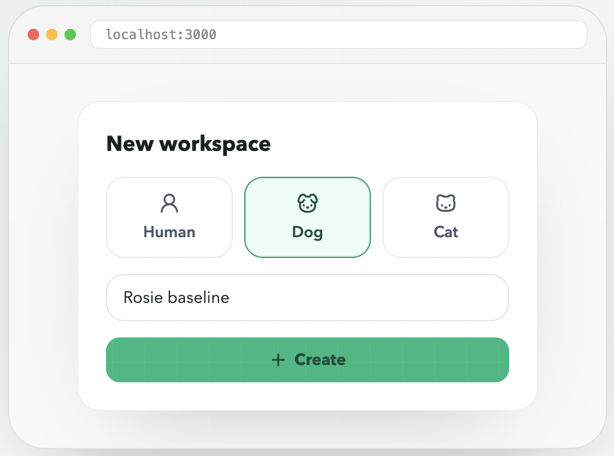

# cancerstudio

You give it two DNA samples — one from the tumor, one from healthy tissue. The pipeline figures out what mutated, predicts which mutations the immune system can target, and designs a personalized mRNA vaccine construct.

The idea is simple: compare tumor DNA against normal DNA, find the differences that matter, and turn those into a vaccine. The pipeline handles upload, alignment, variant calling, neoantigen prediction, epitope selection, and mRNA construct design — all in one workspace.

It's early. Right now the ingestion stage works end-to-end (upload sequencing files, normalize them into paired FASTQ). The rest of the pipeline is being built out stage by stage.

## Backstory

This project started after Paul Conyngham's story about building a personalized mRNA vaccine for his dog Rosie, who had mast cell cancer. That work used BWA-MEM2, Mutect2, VEP, and pVACseq with NetMHCpan to design a seven-target vaccine that achieved 75% tumor shrinkage. His [write-up on X](https://x.com/paul_conyngham/status/2036940410363535823) is worth reading.

The canine case was the starting point, but cancerstudio supports human, dog, and cat — the pipeline adapts to whichever species you're working with.

## What works today

- Create workspaces and switch between them
- Upload FASTQ, BAM, or CRAM files with drag-and-drop
- Batch normalization: compressed FASTQ copies through, uncompressed gets gzipped, BAM/CRAM converts to paired FASTQ via samtools
- Full Docker Compose stack (frontend, backend, Postgres, MinIO)
- Backend test suite covering the ingestion flow

Alignment is next. Everything downstream (variant calling through construct output) is planned but not yet wired up.

### Create a workspace



Start a workspace, choose the species, and name the case before moving into the live ingestion flow.

### Ingestion workspace



Upload FASTQ, BAM, or CRAM files, track normalization, and see when canonical paired FASTQ is ready for alignment.

## Stack

- **Frontend:** Next.js 15.5, React 19, TypeScript, Tailwind CSS
- **Backend:** FastAPI, SQLAlchemy
- **Storage:** PostgreSQL (Docker) or SQLite (local dev), MinIO for files
- **Infra:** Docker Compose with 5 services

## Local development

### Frontend

```bash
npm install
npm run dev
```

### Backend

```bash
cd backend
python -m venv venv
source venv/bin/activate
pip install -r requirements.txt
uvicorn app.main:app --host 0.0.0.0 --port 8000 --reload
```

### Docker (full stack)

```bash
docker compose up --build
```

Runs frontend at `localhost:3000`, backend at `localhost:8000`, MinIO console at `localhost:9001`.

### Environment overrides

Repo-tracked files should stay free of machine-specific absolute paths. Put any
local overrides in an ignored `.env` file instead.

Use `.env.example` as the template for common overrides such as:

- `MINIO_DATA_DIR` for a host-mounted MinIO data directory
- `LOCAL_SQLITE_PATH` for the local SQLite file when `DATABASE_URL` is unset
- `REAL_DATA_SAMPLE_DIR` for pointing real-data tests at a local fixture directory
- `REAL_DATA_ALIGNMENT_SAMPLE_DIR` for BAM/CRAM smoke fixtures

### Lint and tests

```bash
npm run lint
./backend/venv/bin/pytest backend/tests
```

## Automated testing

The repo now has three test tiers:

- Fast backend guardrail: `npm run test:backend:fast`
- Real-data backend integration: `npm run test:backend:real-data`
- Real-data browser smoke: `npm run test:browser:real-data`

The fast suite stays hermetic and is the default PR check. The real-data suites
exercise the live ingestion slice with public FASTQ and BAM/CRAM smoke data,
real Postgres/MinIO services, background normalization, and one browser upload flow.

### Real-data prerequisites

Fetch the smoke FASTQs if you do not already have them:

```bash
npm run sample-data:smoke
npm run sample-data:alignment
```

For backend real-data tests, start the backend against Postgres/MinIO and point
the test at it with `REAL_DATA_API_BASE` if needed. For browser smoke tests,
start both frontend and backend, then install Chromium once:

```bash
npx playwright install chromium
```

For CRAM smoke tests, start the backend with `SAMTOOLS_REFERENCE_FASTA`
pointing at the downloaded `xx.fa`, for example:

```bash
SAMTOOLS_REFERENCE_FASTA=$PWD/data/sample-data/htslib-xx-pair/smoke/xx.fa
```

Optional overrides:

- `REAL_DATA_SAMPLE_DIR` points tests at a different smoke fixture directory.
- `REAL_DATA_ALIGNMENT_SAMPLE_DIR` points tests at a different BAM/CRAM smoke fixture directory.
- `REAL_DATA_API_BASE` changes the backend base URL for the real-data pytest module.
- `PLAYWRIGHT_BASE_URL` changes the frontend base URL for the browser smoke.

## Sample data

For ingestion smoke tests, this repo now includes a helper for the public SEQC2
matched human tumor/normal exome pair:

- Tumor: `SRR7890850` (`WES_LL_T_1`, HCC1395)
- Normal: `SRR7890851` (`WES_LL_N_1`, HCC1395BL)
- Study: `SRP162370`

The downloader renames ENA's `_1` / `_2` files into cancerstudio-friendly
`R1` / `R2` names, because the app currently validates FASTQ filenames using
`R1` / `R2`.

### Download a small smoke-test subset

```bash
npm run sample-data:smoke
```

This writes four small FASTQs to
`data/sample-data/seqc2-hcc1395-wes-ll/smoke/`:

- `tumor_R1.fastq.gz`
- `tumor_R2.fastq.gz`
- `normal_R1.fastq.gz`
- `normal_R2.fastq.gz`

By default the smoke subset keeps `50,000` reads per FASTQ file, which is
`200,000` FASTQ lines.

### Download the full renamed pair

```bash
npm run sample-data:full
```

The full download lands in `data/sample-data/seqc2-hcc1395-wes-ll/full/`.

### Custom options

```bash
python3 scripts/fetch_seqc2_sample_data.py --mode smoke --reads 10000
python3 scripts/fetch_seqc2_sample_data.py --mode smoke --output-dir /tmp/cancerstudio-smoke
python3 scripts/fetch_seqc2_sample_data.py --help
```

Each output directory also gets a `dataset-metadata.txt` manifest with the
source runs, study accession, and source URLs.

### Download BAM/CRAM smoke fixtures

```bash
npm run sample-data:alignment
```

This writes three files to `data/sample-data/htslib-xx-pair/smoke/`:

- `tumor.bam`
- `normal.cram`
- `xx.fa`

The materializer downloads HTSlib's tiny paired SAM sample and reference, then
converts them into a BAM and a CRAM smoke fixture. It uses local `samtools`
when available and falls back to the backend Docker image when it is not.
